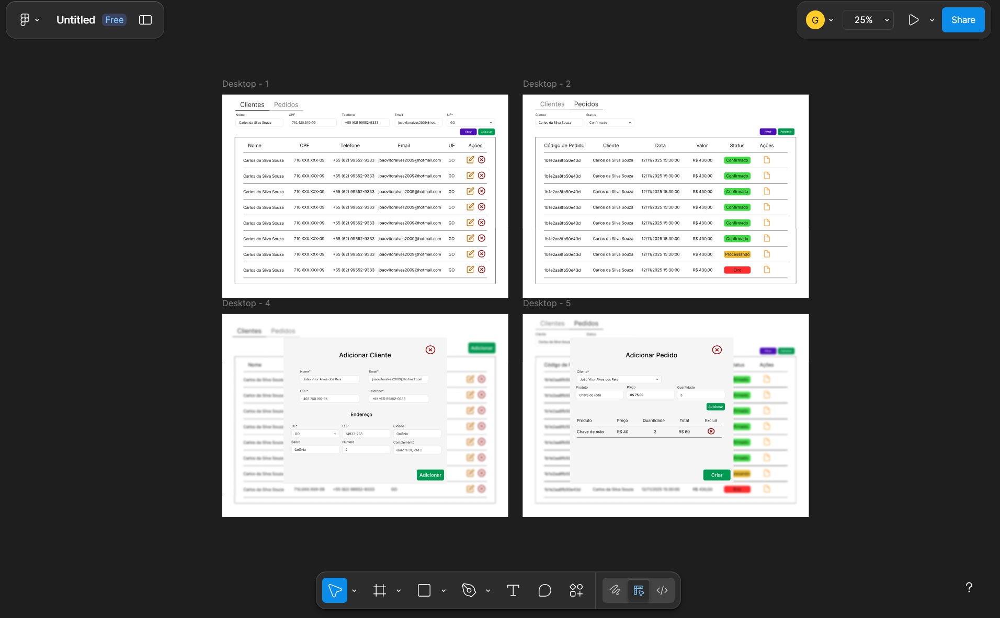
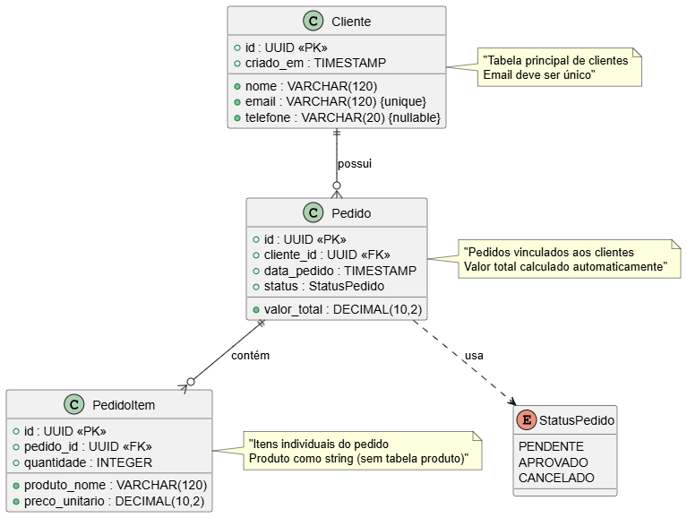

# Sistema de Gestão de Pedidos e Clientes

Sistema desenvolvido em Angular para gestão de pedidos e clientes de uma pequena loja, com funcionalidades completas de CRUD, validações, testes unitários e interface responsiva.

## Funcionalidades

### Gestão de Clientes

- Lista paginada e filtrável de clientes
- Criar, editar e excluir clientes
- Validações de formulário (nome, CPF, email, telefone, UF)
- Mensagens de sucesso/erro com toast notifications
- Modal responsivo para criação/edição

### Gestão de Pedidos

- Lista paginada de pedidos com informações do cliente
- Filtros por cliente e status
- Status com cores diferenciadas (Pendente, Aprovado, Entregue, Cancelado)
- Criação de novos pedidos vinculados a clientes
- FormArray para adicionar/remover itens dinamicamente
- Cálculo automático de valores (item e total do pedido)
- Validações (quantidade > 0, preço >= 0)

### Interface e UX

- Layout responsivo para mobile e desktop
- Componentes PrimeNG para interface moderna
- Toast notifications para feedback
- Navegação por tabs entre Clientes e Pedidos
- Inputs com floating labels

### Testes

- Testes unitários para services e components
- Cobertura de testes para todas as funcionalidades principais
- Mocks para interceptors e API calls

## Protótipo

- A interface foi previamente prototipada no Figma, para melhor modelagem dos requisitos do documento. Pode ser acessado no domínio: https://www.figma.com/design/KZYKmeV55QjX3NpY8139VP/Untitled?node-id=0-1&t=Iryitw6mhulAqsgc-1



## Tecnologias Utilizadas

### Frontend

- **Angular 19** - Framework principal
- **PrimeNG** - Biblioteca de componentes UI
- **RxJS** - Programação reativa
- **TypeScript** - Linguagem de desenvolvimento
- **Jasmine & Karma** - Testes unitários

### API Mock

- **Angular Interceptor** - Mock da API
- **LocalStorage** - Persistência de dados durante a sessão
- **JSON** - Dados mockados

## 📦 Estrutura do Projeto

```
src/
├── app/
│   ├── components/          # Componentes da aplicação
│   │   ├── client-page/     # Página de clientes
│   │   ├── modal/           # Modal de clientes
│   │   ├── order-page/      # Página de pedidos
│   │   ├── order-modal/     # Modal de pedidos
│   │   └── tabs/            # Navegação por tabs
│   ├── services/            # Serviços da aplicação
│   │   ├── client/          # Serviço de clientes
│   │   └── order/           # Serviço de pedidos
│   ├── common/              # Código compartilhado
│   │   ├── dto/             # Data Transfer Objects
│   │   ├── enum/            # Enumerações
│   │   ├── interceptors/    # Interceptors HTTP
│   │   └── json/            # Dados mockados
└── └── app.component.ts     # Componente principal
```

## 🚀 Como Executar o Projeto

### Pré-requisitos

- Docker
- Node.js 20.18.3 e Angular CLI 19 (opcionais)

### 🐳 Execução com Docker

1. **Build e execute com Docker Compose**

```bash
docker-compose up --build
```

2. **Acesse no navegador**

```
http://localhost:4200
```

### Instalação Local (Sem docker)

1. **Clone o repositório**

```bash
git clone <url-do-repositorio>
cd mid-level-fullstack-angular-challenge
```

2. **Instale as dependências**

```bash
cd frontend
npm install --legacy-peer-deps
```

3. **Execute a aplicação**

```bash
ng serve
```

4. **Acesse no navegador**

```
http://localhost:4200
```

## Executar Testes

```bash
# Executar todos os testes
npm test
```

## Banco de Dados

### Modelagem

O sistema utiliza PostgreSQL com as seguintes tabelas:

#### Cliente

- `id` (UUID) - Chave primária
- `nome` (VARCHAR(120)) - Obrigatório
- `email` (VARCHAR(120)) - Único
- `telefone` (VARCHAR(20)) - Opcional
- `criado_em` (TIMESTAMP) - Padrão now()

#### Pedido

- `id` (UUID) - Chave primária
- `cliente_id` (FK) - Referência a cliente.id
- `data_pedido` (TIMESTAMP) - Obrigatório
- `status` (ENUM) - PENDENTE, APROVADO, CANCELADO
- `valor_total` (DECIMAL(10,2)) - Obrigatório

#### Pedido_Item

- `id` (UUID) - Chave primária
- `pedido_id` (FK) - Referência a pedido.id
- `produto_nome` (VARCHAR(120)) - Obrigatório
- `quantidade` (INT) - Obrigatório
- `preco_unitario` (DECIMAL(10,2)) - Obrigatório

### Relacionamentos



### Scripts SQL

Os scripts DDL e DML estão localizados em:

- `sql/ddl.sql` - Criação das tabelas
- `sql/dql.sql` - Consultas
- `sql/seed.sql` - População inicial

### Mock API com Interceptors

- Angular HTTP Interceptor
- Persistência no LocalStorage

## Funcionalidades Extras Implementadas

- **Filtros Avançados**: Por cliente e status nos pedidos
- **FormArray**: Gerenciamento dinâmico de itens do pedido
- **Toast Notifications**: Feedback visual para todas as ações
- **Validações Robustas**: CPF, email, telefone, valores
- **Paginação**: Para melhor performance em listas grandes
- **Layout Responsivo**: Funciona perfeitamente em mobile

## Próximos Passos

Para transformar este projeto em produção:

1. **Integração com API Real**: Substituir por API real
2. **Testes E2E**: Adicionar testes end-to-end
3. **Gráficos**: Implementar dashboards com ngx-charts
4. **Tabela Produto**: Mapear entidade de produto para reutilização e melhor referência no banco de dados
